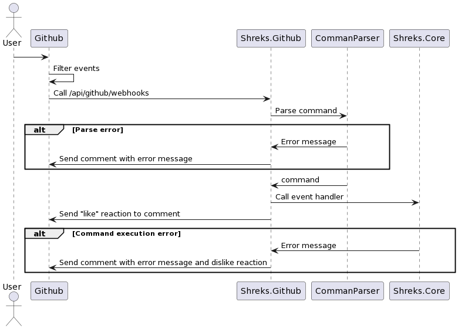

# Github integration

Интеграция с гитхабом заключается в прослушивании ряда событий, которые случаются на гитхабе и реагирование системой на них. Список событий, которые нужно обработать:

- Создание Pull request
- Закрытие/мёрдж PR
- Добавление нового комита в PR
- Отправка команды `/rate`
- Отправка команды `/update`
- Добавление ревью в PR

Создание Pull request. Создание PR должно вызывать команду создания нового сабмишена. Дополнительные сценарии:

- В системе нет информации о пользователе, который создал PR - нужно написать комментарий о том, что пользователь не добавлен, и что его нужно добавить в систему.
- Не удалось определить номер лабораторной работы из названия ветки - нужно сообщить пользователю о том, что ветка должна называться в соответствии с паттерном и что нужно переоткрыть PR.
- У данного пользователя уже есть PR на данную лабораторную работу - нужно предупредить о том, что есть другой PR к этому заданию и добавить ссылку. Если старый PR не закрыт, то создавать новый сабмишен нельзя и нужно предложить продолжить работать со старой веткой.

Закрытие или мёрдж PR. PR должен закрываться или мёрджится после того, как в нём закончится работа. В нормальной ситуации система никак не должна реагировать на закрытие, кроме сообщения о том, что всё ок. Дополнительные сценарии:

- В системе нет информации о данном PR - сообщить о том, что система не затрекала создание PR
- Последний сабмишен в данном PR не был оценён или был оценён не на максимальный балл - сообщить о том, что в этом PR не была закончена работа над заданием. Если PR висел в очереди на сдачу, то его нужно удалить из очереди.

Добавление нового комита в PR. Если добавляется новый код, значит прошлый коммит не может претендовать на сдачу и нужно отправить команду обновления даты загрузки данного сабмишена. Если PR уже был оценён и это новый коммит, то нужно отправить команду создания нового сабмишена. Дополнительные сценарии:

- В системе нет информации о данном PR - сообщить о том, что система не затрекала создание PR
- Комит сделал не студент, а преподаватель - такое событие не должно обновлять дату загрузки сабмишена

Отправка в комментарии к PR команды `/rate`. Данная команда позволяет преподавателю оценивать работу вызывая команду выставления баллов. В команду нужно передавать процент выполнения (целое число от 0 до 100) и дополнительные баллы (число от 0 до 100). Дополнительные сценарии:

- В системе нет информации о данном PR - сообщить о том, что система не затрекала создание PR
- Последний сабмит уже оценён - сообщить о том, что оценка уже стоит и для обновления нужно воспользоваться другой командой
- У пользователя нет прав вызывать эту команду - сообщить о том, что команда доступна только администраторам организации
- Введены не все необязательные аргументы или введены не правильно - сообщить о том, как правильно вызывать команду
- В тексте комментария не только строка с командой, но и другой текст - система должна искать команду только в первой строке комментария и валидно обработать текст после команды

Отправка в комментарии к PR команды `/update`. Данная команда позволяет преподавателю обновить баллы вызывая команду обновления. В команд нужно передавать идентификатор сабмишена, новый процент выполнения, новую дату сдачи и новые дополнительные баллы.

- В системе нет информации о данном PR - сообщить о том, что система не затрекала создание PR
- У пользователя нет прав вызывать эту команду - сообщить о том, что команда доступна только администраторам организации
- Указанного сабмишена нет в системе - сообщить о том, что введён неправильный сабмишен и вывести список доступных сабмишенов для этого PR
- Введены не все необязательные аргументы или введены не правильно - сообщить о том, как правильно вызывать команду
- Не передаётся идентификатор сабмишена - команда применяется к последнему сабмишену и валидно отрабатывает
- Передаётся только баллы и дополнительные баллы - команда обновления оставляет старую дату выполнения и обновляет только баллы
- Передаётся только дата сдачи - команда обновления оставляет баллы и обновляет только дату сдачи
- В тексте комментария не только строка с командой, но и другой текст - система должна искать команду только в первой строке комментария и валидно обработать текст после команды

Добавление ревью в PR. Обычно, во время проверки работы, преподаватель использует механизм "Code review", чтобы оставлять комментарии и замечания. Ожидается, что при добавлении ревью будет также оставляться команда выставления или обновления баллов. Дополнительные сценарии:

- В системе нет информации о данном PR - сообщить о том, что система не затрекала создание PR
- У пользователя нет прав оценивать работы - сообщить о том, что оценка работ в ревью доступна только администраторам организации
- Комментарий к ревью не содержит команды выставления баллов - сообщить о том, что после ревью преподаватель должен выставить баллы используя команды

