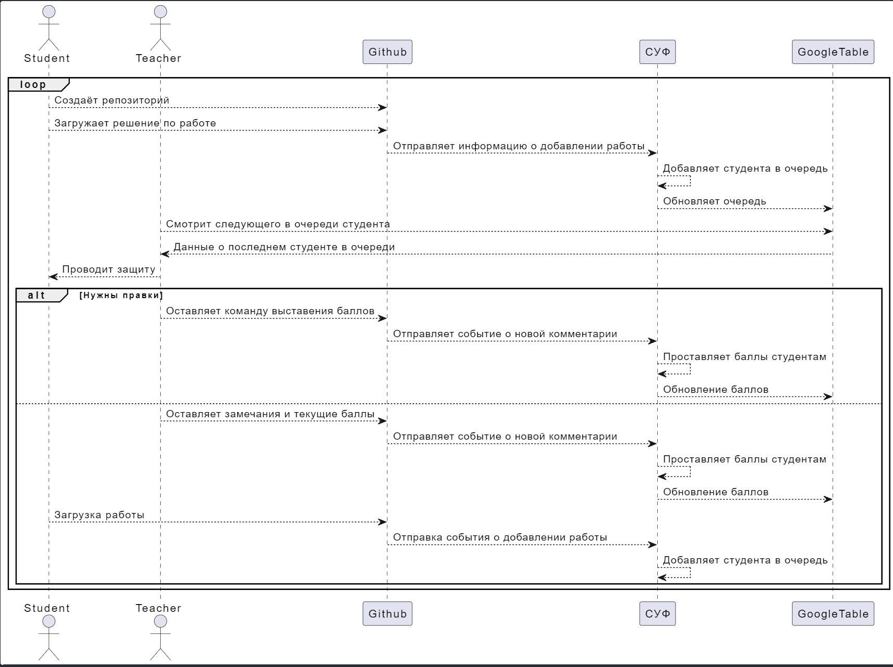

# Процесс проведения практических занятий

- Цель: Проведение мероприятия по сдаче и защите выполненных работ студентами

1. Студент приступает к решению задания, знакомится с условием и создаёт branch в своём локальном репозитории
2. Студент выполняет задание, создаёт коммиты с изменениями
3. Студент выполняет push своей ветки на GitHub и создаёт pull request из неё в мастер
4. Система обрабатывает созданный pull request и регистрирует в системе попытку сдачи
5. Система добавляет студента в очередь
6. Преподаватель проверяет pull request'ы, даёт фидбек и оценивает
   1. Если работа проходит по всем критериям, то преподаватель делает Review approve
   2. Если к работе есть замечания, то преподаватель делает request changes
7. После каждого ревью система обновляет статус у сабмишена, обновляет очередь и баллы за работу
8. По окончании работы над pull request происходит его merge

