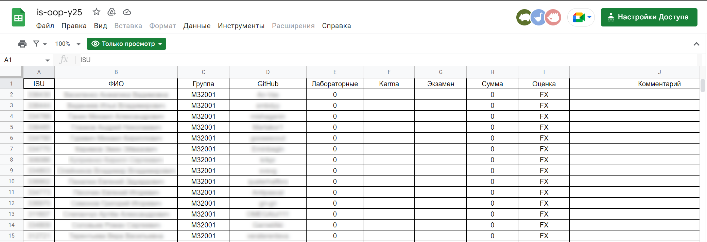
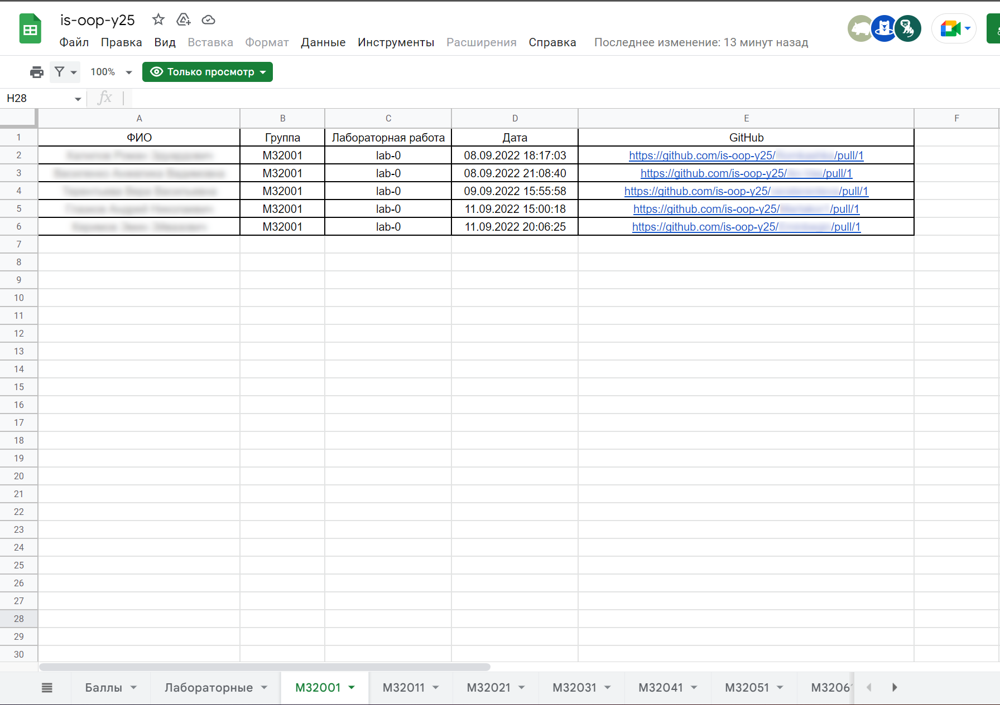

# ASAP

> – Дядя Фёдор, а давай бизнес-процессы автоматизируем! \
> – Чтобы автоматизировать бизнес-процессы, нужно чтобы в компании бизнес-процессы были, а у нас даже простых регламентов
> нет, чёрт его знает, кто за что отвечает, аджайл же.

Система предназначена для автоматизации процесса обучения, а именно: процессов отправки заданий студентами, формирования
очереди и оценивания заданий преподавателями.

## Idea

Образовательный процесс на дисциплинах, связанных с программированием, требует написания и ревью кода. Для этого хорошо
подходит Github с его Pull request и Review request системами. Но в отличие от обычной разработки, в контексте
образования важно отслеживать прогресс и оценивать работу студентов. ASAP - это сервис, который за счёт Github app и
прослушивания Webhooks с Github интегрируется с процессов проверки, обрабатывает команды и управляет очередями и системой
оценивания. В качестве Presentation layer система использует Google Sheet. В директории Google Drive генерируются таблицы
успеваемости и таблицы с очередями на сдачу.

## Motivation

Стандартизация и унификация позволит:

- Автоматизация развёртывания инфраструктуры
- Автоматизация синхронизации действий преподавателя в GitHub и Google Sheet
- Автоматическое создание и обновление очереди сдачи

## Процесс использования системы для конечного пользователя

Система использует API Github для отслеживания действий студентов и преподавателей и API Google для презентации
информации пользователям.

Для каждой дисциплины после добавления в систему:

- Создаётся организация;
- Отправляются приглашения в организацию студентам (у Github есть лимит в 50 приглашений в день, приглашения отправляются
  каждый день в фоновом процессе);
- Создаются для студентов их личные приватные репозитории по указанному шаблонному репозиторию;
- Создаётся таблица в Google Sheets и заполняется данными о студентах.

Как с системой работает студент:

- Принимает приглашение в организацию;
- Клонирует созданный репозиторий, создаёт ветку и загружает решение задания;
- Создаёт PR, вносит правки после ревью;
- Ориентируется на сгенерированную в Google Sheets очередь во время сдачи.

Как с системой работает преподаватель/ментор:

- Принимает приглашение в организацию;
- Ориентируется на очередь для определения порядки принятия студентов;
- При просмотре PR делает review.

В это время система:

- Отслеживает создание Pull request и добавляет студента в очередь, обновляет очередь в Google Sheets;
- Отслеживает результаты review, отслеживает оценки и обновляет их в Google Sheets.

Пример сгенерированной таблицы с баллами:

Пример сгенерированной таблицы с очередью:

## План реализации

- [x] Реализовать основную логику работы приложения
- [x] Добавить двухэтапную проверку - ревью и очная защита
- [ ] Поддержать сценарий, когда для каждого задания создаётся отдельный репозиторий
- [ ] Добавить интеграцию с GitHub OAuth и ITMO ID
- [ ] Поддержать отслеживание выполнения работ в команде
- [ ] Интеграция с CI и отслеживание успешных и проблемных запусков
- [ ] Добавить возможность кастомизировать сгенерированные таблицы

## How to config infrastructure

1. Настроить Google integration - [Google integration](Docs/Deployment-guides/Setup-google-service-acoount.md)
2. Настроить Github integration - [Github OAuth](Docs/Deployment-guides/Setup-google-service-acoount.md)